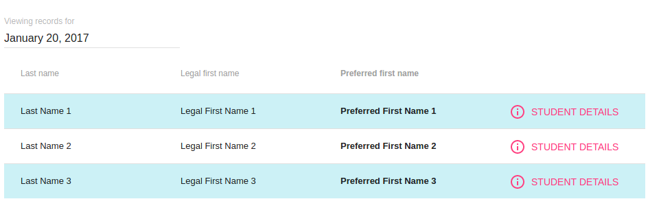

# Preferred Names Soffit

### View a record of preferred name changes for a given day.

This is a template of an [Apereo Soffit](https://github.com/drewwills/Soffit) created in January 2017 for Oakland University's implementation of [uPortal](https://github.com/jasig/uPortal).

The template is designed to work with base uPortal using mock data.

Spring project created using the [Spring Initializr](https://start.spring.io).
UI created with React.js using [create-react-app](https://github.com/facebookincubator/create-react-app) and [material-ui](https://github.com/callemall/material-ui).
